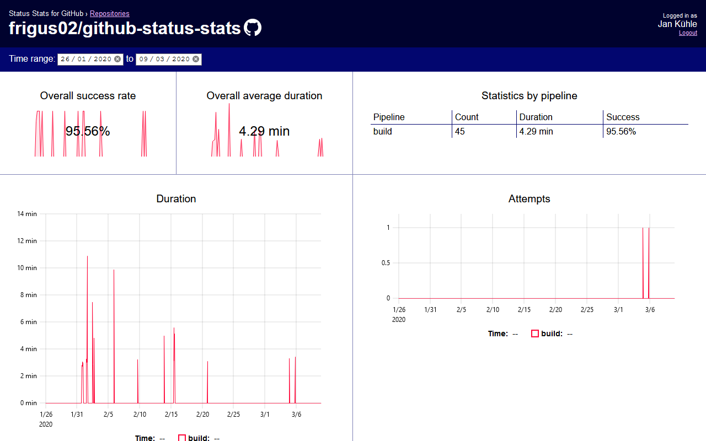

# GitHub Status Stats

If you're using any CI system on your GitHub repository, chances are it pushes commit statuses to GitHub. The most recent ones are shown on the commit, as a :heavy_check_mark: tick or :x: cross.

GitHub stores a history of all commit statuses. If you retry a build on the same commit, it doesn't overwrite the previous status. It adds a new one. This gives us the ability to do some fun statistics. For example:

- Show builds with high/low success rate
- Show attempts needed for a build to pass
- Show build duration changes over time

We can use this to find flaky builds or prove builds got flakier or less flaky over time.

This repository contains:

- Scripts to download the commit status information from GitHub.
- Scripts to aggregate stats and write the to an InfluxDB.
- A Grafana dashboard for these stats.
- A Docker setup for a local InfluxDB and Grafana container.



## Usage

### Start InfluxDB and Grafana

The [`docker-compose.yml`](docker-compose.yml) starts an InfluxDB and Grafana with a preconfigured datasource and dashboard. After startup the dashboard should be available under <http://localhost:3000/d/builds>.

```
docker-compose up
```

### Download data and write to InfluxDB

Create a [configuration](#configuration). Then run the tool:

```sh
./scripts/dotenv.sh cargo run
```

```posh
.\scripts\dotenv.ps1 cargo run
```

On first run this will download the status information from GitHub and store it in a `data/` folder. Conescutive runs will then work based on the local data.

## Configuration

Configuration works through environment variables. Create a `.env` file with the following keys. See [`.env.example`](.env.example) for an example file.

| Key                        | Value                                                                                                                                                                                                                                                                                                                                                                                          | Required         |
| -------------------------- | ---------------------------------------------------------------------------------------------------------------------------------------------------------------------------------------------------------------------------------------------------------------------------------------------------------------------------------------------------------------------------------------------- | ---------------- |
| `GH_TOKEN`                 | Personal access token for GitHub API. Needs permissions to read repo.                                                                                                                                                                                                                                                                                                                          | Yes <sup>1</sup> |
| `GH_OWNER`                 | GitHub repo owner, e.g. `frigus02`                                                                                                                                                                                                                                                                                                                                                             | Yes <sup>1</sup> |
| `GH_REPO`                  | GitHub repo name, e.g. `github-status-stats`                                                                                                                                                                                                                                                                                                                                                   | Yes <sup>1</sup> |
| `GH_COMMITS_SINCE`         | The tool will download commits and their statuses bewteen this and `GH_COMMITS_UNTIL`, e.g. `2019-08-01T00:00:00Z`                                                                                                                                                                                                                                                                             | Yes              |
| `GH_COMMITS_UNTIL`         | The tool will download commits and their statuses between `GH_COMMITS_SINCE` and this, e.g. `2019-10-10T00:00:00Z`                                                                                                                                                                                                                                                                             | Yes              |
| `STATUS_CONTEXT_TRANSFORM` | Expression to transform [status context](https://developer.github.com/v3/repos/statuses/), which is reported as the build name. Can be used to remove common prefixes, normalize names when they changed over time and more. Syntax is similar to sed: `s/SEARCH/REPLACE/`. Spaces and slashes inside seach and replace have to be escaped. Can include multiple space separated instructions. | No               |
| `BUILD_CANCELED_REGEX`     | Expression to determine if a build has been cancelled. It's a regular expression matched against the [status description](https://developer.github.com/v3/repos/statuses/).                                                                                                                                                                                                                    | No               |

1. Commits and their statuses are cached locally in a `data/` folder. GitHub repo information and access token are only required if the commits inside the specified range don't already exist locally.

## Development

### Website

Install helpers

```
cargo install systemfd cargo-watch
```

Then start

```
ngrok http 8888 &
cd website/
systemfd --no-pid -s http::8888 -- cargo watch -x run
```

### Data model

#### Build

- Measurement: `build`
- Tags:
  - `name`: `status.context` or `check_run.name`
  - `commit`: commit SHA
- Fields:
  - `successful`: `true` or `false`
  - `duration_ms`
- Timestamp: `status.created_at` or `check_run.started_at`

#### Import

- Measurement: `import`
- Fields:
  - `commits_since`: unix timestamp
- Timestamp: import date

#### Hook

- Measurement: `hook`
- Tags:
  - `type`: `status` or `check_run`
  - `commit`: commit SHA
- Timestamp: hook date
